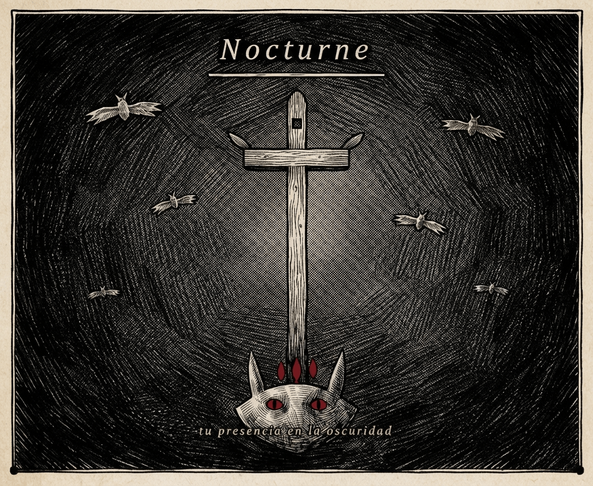

<!-- Importamos la fuente MedievalSharp desde Google Fonts -->
<link rel="preconnect" href="https://fonts.googleapis.com">
<link rel="preconnect" href="https://fonts.gstatic.com" crossorigin>
<link href="https://fonts.googleapis.com/css2?family=MedievalSharp&display=swap" rel="stylesheet">

<!-- Bloque de texto gótico centrado -->

¿Alguna vez has querido cambiar de cuenta pero te ha frenado la idea de perder todos tus canales y playlists favoritas? De esa frustración nace The Nocturne, una extensión de Chrome creada con sensibilidad y pensada para facilitarte la vida. Con ella, podrás exportar fácilmente todo tu contenido a otras cuentas de forma rápida y sin complicaciones. No dejes que tus listas de reproducción se queden atrás; con The Nocturne, tu contenido favorito te acompaña siempre que lo necesites

[Politicas de Privacidad](https://gist.github.com/chrispam123/3a0a7175d372d29b1cb354cc4d57d594)

Problemas técnicos uopechris@gmail.com
